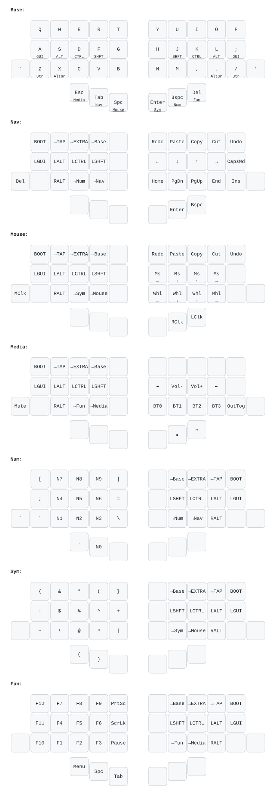

# Keymap diagram

`totem.svg` is a rendered picture of all 7 miryoku layers, generated from
`miryoku/custom_config.h` with [keymap-drawer](https://github.com/caksoylar/keymap-drawer).



## Regenerate

```sh
./build.sh        # or: make img
```

First run creates a local `.venv` and installs `keymap-drawer`. Re-run after
editing your layers in `miryoku/custom_config.h`.

## How it works

miryoku defines layers with C macros (`MIRYOKU_LAYER_*`), which keymap-drawer
can't parse directly. `gen_yaml.py` reads those macros, expands them into a
keymap-drawer YAML (`totem.yaml`), then `keymap draw` renders the SVG.

- `gen_yaml.py`     — parses the layer macros → `totem.yaml`
- `totem_info.json` — physical layout of the 38-key totem (incl. the 2 outer keys)

If you restructure layers heavily (rename layers, change the mapping), update
the label maps / order logic in `gen_yaml.py`.
